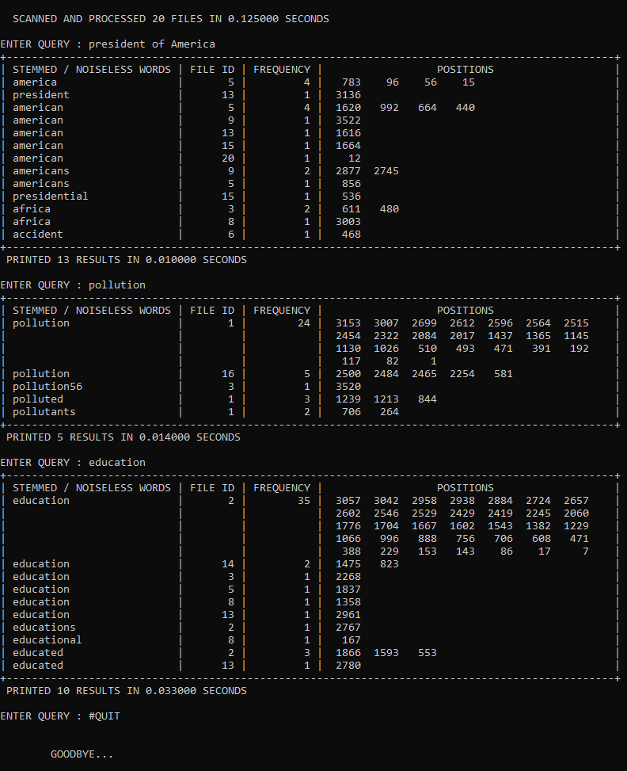

## ABOUT
This is a miniature search engine that runs and scans information from the locally stored data on your machine and then indexes the informations into various data structures. Unlike the quintessential crawling, it does a sequential scanning of multiple text documents and does not follow any network or graph of hyperlinks. Hybrid of multiple data structures is used to make the search as efficient as possible. Particularly, multilevel hashmaps and a blend of suffix tries and hashmaps and prefix tries and hashmaps are used. Removal of noise and stopwards in the data as well as the query have also been taken care of during processing. 

The query is processed and accordingly information is retrieved from the data structures. The search is entirely based on the words, or more specifically the characters in the query, rather than their actual meaning or context. The relevance of each word in the search results with respect to the closest word in the query is kept inversely proportional to the edit distance between the two words and accordingly the results are sorted and displayed. In case of same relevance, frequency and lexicographic order are checked. The relavance of the search results to the query can be increased by introducing some threshold on the edit distance in the main function, where the final printing is done. Similarly, more stopwords can also be introduced.

***Keep all the input text documents in the same directory as the code while maintaining the file naming convention. Do not forget to change the number of files to be processed in the main function. The size of hashmaps can also be tweaked accordingly. Pass "#QUIT" as query to terminate the program.** 20 input files have also been provided in the repository for demo.* 

&nbsp;&nbsp;&nbsp;&nbsp;
